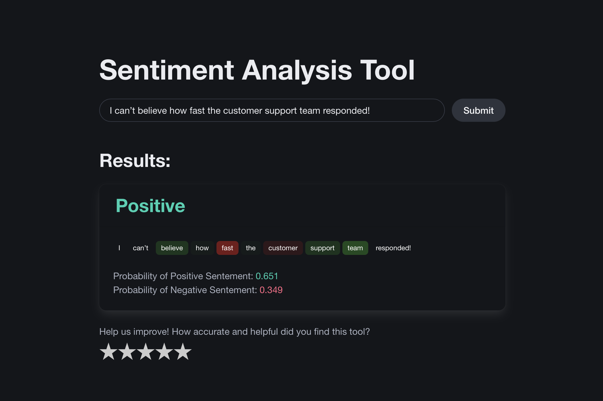
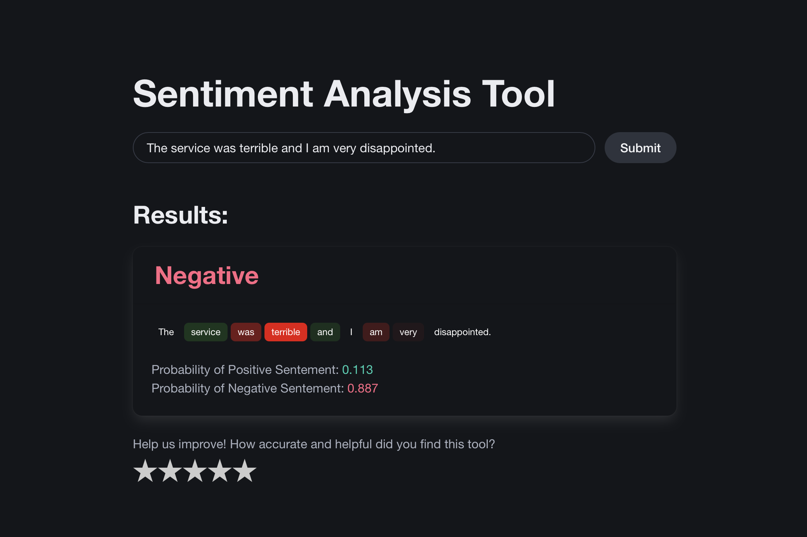

# Sentiment Analysis Application
<p align="center">
  
  
</p>

This project implements a **Sentiment Analysis** application with a **React** frontend, **FastAPI** backend, and a dedicated **analysis** section for exploring different machine learning models. The application allows users to input text, analyze its sentiment, and display the results.

## Project Structure

- **`/frontend`**: React + TypeScript frontend.
- **`/backend`**: FastAPI backend powered by Unicorn for running sentiment analysis.
- **`/analysis`**: Model analysis and experimentation folder, dedicated to working with various sentiment analysis models.

## Sentiment Analysis Overview

Sentiment analysis is the process of determining the sentiment expressed in a piece of text. It typically classifies text as **positive**, **negative**, or **neutral**. This project utilizes machine learning models to analyze text and classify its sentiment.

### Key Features:
- **Text Input**: Enter text into the frontend interface.
- **Sentiment Analysis**: Sentiment is processed and analyzed by a FastAPI-based backend.
- **Results Display**: The sentiment score and classification are displayed on the frontend.
- **Model Analysis**: Different models for sentiment analysis can be explored and compared in the `/analysis` directory.

## Getting Started

### Prerequisites

Make sure you have the following installed:
- [Node.js](https://nodejs.org/)
- [Yarn](https://yarnpkg.com/)
- [Python 3.x](https://www.python.org/downloads/)
- [pip](https://pip.pypa.io/en/stable/)

### Setup

#### 1. Backend Setup

1. Navigate to the `/backend` directory:

    ```bash
    cd backend
    ```

2. Install the required dependencies:

    ```bash
    pip install -r requirements.txt
    ```

3. Run the FastAPI server with Unicorn:

    ```bash
    uvicorn main:app --reload
    ```

4. The backend will be accessible at [http://localhost:8000](http://localhost:8000).

#### 2. Frontend Setup

1. Navigate to the `/frontend` directory:

    ```bash
    cd frontend
    ```

2. Install the required dependencies:

    ```bash
    yarn install
    ```

3. Start the React development server:

    ```bash
    yarn start
    ```

4. The frontend will be accessible at [http://localhost:3000](http://localhost:3000).

#### 3. Analysis Setup

The `/analysis` folder contains various models and experiments for sentiment analysis. This folder is intended for researchers and data scientists looking to evaluate and compare different models.

1. Navigate to the `/analysis` directory:

    ```bash
    cd analysis
    ```

2. You can use Jupyter notebooks, scripts, or other tools to analyze and test different sentiment analysis models.

